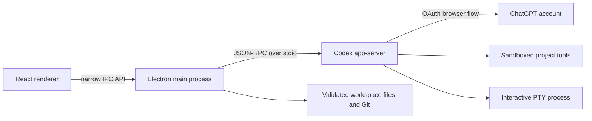

# Lodex architecture

## Runtime map

The renderer is sandboxed with Node integration disabled and context isolation enabled. A preload script exposes only the operations the Lodex UI needs.

## Authentication

Lodex starts `account/login/start` with the managed `chatgpt` login type and opens the returned authorization URL in the system browser. The Codex runtime owns the callback, token persistence, and refresh lifecycle. Lodex does not render a password form, inspect tokens, or copy credentials into its own settings.

## Codex protocol

`electron/codex-client.ts` owns one local app-server process and performs the required `initialize` / `initialized` handshake. It correlates JSON-RPC responses, forwards event notifications, and relays server approval requests to the UI.

The renderer uses these stable surfaces:

- `account/read`, managed ChatGPT login/logout, account usage, and rate limits
- `model/list`
- `thread/start`, `thread/resume`, `thread/list`, rename, and archive
- thread goals and context compaction
- `turn/start`, streaming item and plan notifications, and `turn/interrupt`
- app and skill discovery
- `command/exec` PTY streaming for the user-controlled terminal

Models are discovered at runtime instead of being maintained as a stale hard-coded registry.

## Product surfaces

- **ChatGPT / Chat** starts a conversation without assigning a project directory and uses a read-only sandbox.
- **ChatGPT / Work** adds goal and activity affordances while retaining the selected project as optional context.
- **Codex** binds turns to the selected project and exposes files, Git, and the terminal. Internally this remains the `build` surface for app-server compatibility.
- Chat pins are a local Lodex preference because the current app-server thread metadata does not expose a pin field. Thread names, history, goals, and archive state remain server-managed.

## Filesystem and process boundaries

- File reads/writes and Git paths are resolved through their real filesystem paths and must remain inside the selected project.
- Directory symlinks are not traversed by the file tree.
- The local-image protocol accepts supported image extensions only and limits access to the project or images explicitly chosen by the user.
- Generic renderer-to-app-server access is denied. Allowed methods are enumerated and sensitive parameters are normalized in the main process.
- Chat turns use the `read-only` sandbox; Work and Build turns use `workspace-write` and the selected project when one is available.
- The terminal is a user-controlled login shell. Its start command and session IDs are validated by the main process.
- External links are opened by the operating system rather than navigating the Lodex renderer.

## Packaging

Linux packages must be built on Linux. That ensures npm installs the correct platform-specific Codex binary before Electron Builder creates the AppImage and Debian package. Cross-building from Windows is intentionally not the release path because the Windows npm install contains the Windows Codex runtime.

## Reliability and 0.3 client state

Renderer input is normalized before display, including object-shaped `PatchChangeKind` values. Item error boundaries contain a bad activity; the app boundary offers a recovery screen. Token chunks are batched, command previews are capped, transcript rendering is paged, and Monaco is loaded on demand.

Electron retains the app-server and unresolved approval requests across renderer reloads. The renderer restores its active thread with `thread/resume` and never replays `turn/start`. Drafts and mode preferences live in local storage. The main process bounds automatic crash reloads and records category-only diagnostics. Linux uses software rendering by default.

Chat editing and retry use `thread/read` plus `thread/fork` through the preceding completed turn (or a new thread for the first prompt), never destructive rollback. Continuing a thread retains that thread's working directory rather than redirecting it to whichever project was most recently selected.

Attachments must first be selected through a native file dialog. The main process verifies the selected paths and size limits before constructing runtime input. Approved attachment paths persist so drafts can recover after a restart. Runtime-produced image paths are authorized only when the runtime references them in generated-image items. Chat export uses a native Save dialog and writes Markdown only to the chosen destination.

See [0.3 release notes](RELEASE-0.3.md) for the supported feature boundary and test workflow.
